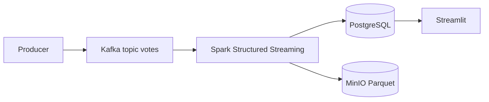

# Election Streaming

Pipeline de **Data Engineering temps réel** pour simuler, transporter, traiter et visualiser des votes électoraux (Sénégal et diaspora).

**Producer Python → Kafka KRaft (`votes`) → Spark Structured Streaming → PostgreSQL + MinIO → Streamlit**

---

## Objectifs

- Simuler des votes nationaux et diaspora à partir de référentiels JSON
- Publier les événements sur Apache Kafka (mode KRaft)
- Traiter le flux avec Spark Structured Streaming (un seul `foreachBatch`)
- Persister les votes bruts et les agrégations dans PostgreSQL
- Archiver les votes en Parquet dans MinIO (data lake)
- Visualiser les résultats via un dashboard Streamlit (lecture PostgreSQL uniquement)

---

## Architecture



Documentation détaillée : [docs/architecture.md](docs/architecture.md) · Rapport : [RAPPORT_FINAL.md](RAPPORT_FINAL.md)

---

## Technologies

| Technologie | Rôle |
| ----------- | ---- |
| Python 3 | Producer, dashboard |
| Apache Kafka 3.7 (KRaft) | Bus d’événements |
| Spark 3.5.1 Structured Streaming | Traitement temps réel |
| PostgreSQL 16 | Votes bruts + agrégations |
| MinIO | Data lake Parquet (S3A) |
| Streamlit + Plotly | Visualisation |
| Docker Compose | Orchestration locale |

---

## Structure du dépôt

```text
election-streaming/
├── docker-compose.yml
├── .env.example
├── README.md
├── RAPPORT_FINAL.md
├── docs/                      # Documentation française complète
├── producer/
│   ├── Dockerfile
│   └── app/
│       ├── main.py
│       ├── generator.py
│       ├── kafka_client.py
│       ├── config.py
│       └── data/              # candidats.json, centres_vote.json, …
├── spark/
│   ├── Dockerfile
│   ├── entrypoint.sh
│   └── app/                   # Code Spark (chemins réels)
│       ├── app.py
│       ├── config.py
│       ├── constants.py
│       ├── schemas.py
│       ├── transformations.py
│       ├── aggregations.py
│       └── sinks/
│           ├── postgres.py
│           └── minio.py
├── postgres/
│   ├── init.sql               # Init Docker
│   └── schema.sql             # Miroir documentaire
├── dashboard/
│   ├── Home.py
│   ├── database.py
│   └── pages/
├── kafka/
│   └── create_topics.sh
└── scripts/
    ├── bootstrap.sh
    └── wait-for-it.sh
```

---

## Démarrage rapide

### Prérequis

Docker + Docker Compose v2, ports libres (8080, 8081, 8501, 9001, 5050, 5432, 9092, …).

### Lancement

```bash
cp .env.example .env
docker compose up --build
```

Ou : `./scripts/bootstrap.sh`

### Interfaces

| Service | URL |
| ------- | --- |
| Kafka UI | http://localhost:8080 |
| Spark UI | http://localhost:8081 |
| Streamlit | http://localhost:8501 |
| MinIO Console | http://localhost:9001 |
| PgAdmin | http://localhost:5050 |

Variables d’environnement : voir `.env.example` (`POSTGRES_*`, `MINIO_*`, `KAFKA_TOPIC`, `VOTE_INTERVAL_SECONDS`, `SENEGAL_VOTE_RATIO`, `TRIGGER_INTERVAL`, `SHUFFLE_PARTITIONS`, `SPARK_WORKER_*`, …).

Guide install : [docs/installation.md](docs/installation.md) · Docker : [docs/docker.md](docs/docker.md)

---

## Fonctionnement du pipeline

1. **Producer** — génère un vote JSON (`vote_id`, `timestamp`, `cni`, géographie, `candidat`, …) et le publie sur le topic `votes`.
2. **Kafka** — transporte les messages (KRaft, sans ZooKeeper).
3. **Spark** — parse / clean / enrich, puis dans un `foreachBatch` :
   - append Parquet → MinIO ;
   - append → `votes_bruts` ;
   - recalcul des tables d’agrégation (overwrite + truncate) avec `dropDuplicates(vote_id)`.
4. **Streamlit** — affiche les KPI depuis PostgreSQL (cache 5 s).

Détails : [docs/streaming.md](docs/streaming.md) · Spark : [docs/spark.md](docs/spark.md) · Producer : [docs/producer.md](docs/producer.md)

---

## Tables PostgreSQL

| Table | Rôle |
| ----- | ---- |
| `votes_bruts` | Historique des votes enrichis (append) |
| `resultats_candidats` | Votes par candidat |
| `resultats_regions` | Votes par région (Sénégal) |
| `resultats_departements` | Votes par département |
| `resultats_bureaux` | Votes par bureau |
| `resultats_diaspora` | Votes par continent / pays |
| `participation_sexe` | Répartition par sexe |
| `participation_age` | Répartition par tranche d’âge |
| `resultats_profession` | Répartition par profession |

Schéma complet : [docs/postgres.md](docs/postgres.md)

---

## Extensions métier

| Action | Fichier |
| ------ | ------- |
| Ajouter un candidat | `producer/app/data/candidats.json` |
| Ajouter une région / centres / bureaux | `producer/app/data/centres_vote.json` |

Puis `docker compose restart producer`. Voir [docs/producer.md](docs/producer.md).

---

## Documentation

Index : **[docs/README.md](docs/README.md)**

| Document | Contenu |
| -------- | ------- |
| [architecture](docs/architecture.md) | Composants et diagrammes |
| [installation](docs/installation.md) | From scratch |
| [docker](docs/docker.md) | Services, volumes, env |
| [kafka](docs/kafka.md) | Topic, KRaft, tests |
| [spark](docs/spark.md) | Session, packages, foreachBatch |
| [postgres](docs/postgres.md) | Tables et colonnes |
| [minio](docs/minio.md) | Bucket, Parquet, S3A |
| [dashboard](docs/dashboard.md) | Pages Streamlit |
| [producer](docs/producer.md) | Schéma votes |
| [streaming](docs/streaming.md) | Flux E2E |
| [troubleshooting](docs/troubleshooting.md) | Incidents |
| [deployment](docs/deployment.md) | Déploiement / rebuild |
| [optimisation](docs/optimisation.md) | Tuning Spark / JDBC / MinIO |
| [changelog](docs/changelog.md) | Bugs et correctifs |

Rapport exécutif : **[RAPPORT_FINAL.md](RAPPORT_FINAL.md)**

---

## Auteurs

**Mamadou Yassarou Diallo** · **Fallou Diouk**

Projet réalisé dans un cadre pédagogique de Data Engineering.

## Licence

Distribution à des fins pédagogiques et de démonstration.
