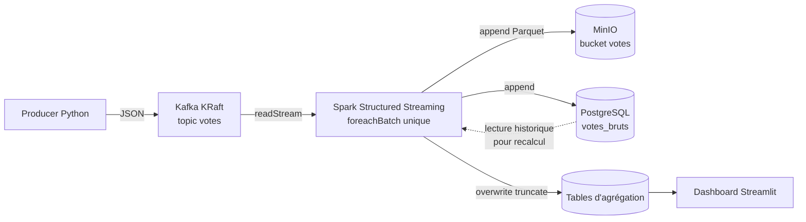
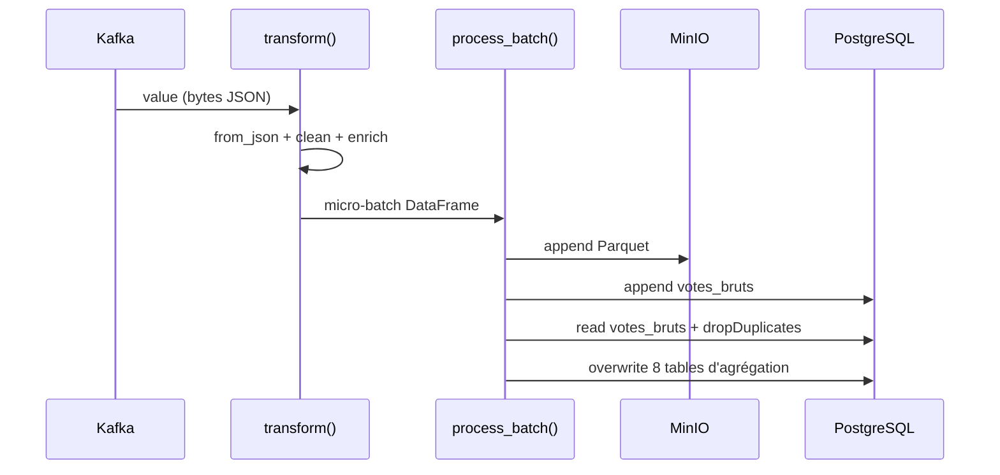

# Architecture — Election Streaming

## Vue d’ensemble

Le projet implémente un pipeline de **streaming électoral** local, conteneurisé avec Docker Compose. Les votes simulés (Sénégal et diaspora) transitent par Kafka, sont traités par Spark Structured Streaming, puis stockés dans PostgreSQL (opérationnel) et MinIO (data lake Parquet). Le dashboard Streamlit lit **uniquement** PostgreSQL.



## Principes de conception

| Principe | Application |
| -------- | ----------- |
| Une seule requête de streaming | Un `writeStream.foreachBatch` nommé `election_main_pipeline` |
| Source de vérité opérationnelle | PostgreSQL (`votes_bruts` + tables d’agrégation) |
| Archive analytique | MinIO (`s3a://votes/votes/`) au format Parquet Snappy |
| UI découplée | Streamlit ne parle qu’à PostgreSQL (cache TTL 5 s) |
| Idempotence partielle | `dropDuplicates(["vote_id"])` avant recalcul des agrégations |

## Composants

### 1. Producer (`producer/app/`)

- Génère des votes Sénégal (~80 %) ou diaspora (~20 %) selon `SENEGAL_VOTE_RATIO`.
- Publie sur le topic configuré par `KAFKA_TOPIC` (défaut : `votes`).
- Schéma aligné avec `spark/app/schemas.py` (`vote_id`, `timestamp`, `cni`, `profession`, `continent`, …).

### 2. Kafka (KRaft)

- Image `apache/kafka:3.7.1` en mode **broker + controller** (sans ZooKeeper).
- Listeners internes : `PLAINTEXT://kafka:9092`.
- UI Provectus sur le port hôte **8080**.

### 3. Spark Structured Streaming (`spark/app/`)

Structure du code (chemins réels) :

```text
spark/
├── Dockerfile
├── entrypoint.sh
├── requirements.txt
└── app/
    ├── app.py              # Point d'entrée, foreachBatch
    ├── config.py
    ├── constants.py
    ├── schemas.py
    ├── transformations.py  # parse → clean → enrich
    ├── aggregations.py
    └── sinks/
        ├── postgres.py
        └── minio.py
```

Cluster Compose :

| Service | Rôle |
| ------- | ---- |
| `spark-master` | Master (`7077`), UI mappée sur hôte **8081** |
| `spark-worker` | Worker rattaché au master |
| `spark-app` | `spark-submit` client mode → `app.py` |

### 4. PostgreSQL

- Image `postgres:16`, volume nommé `postgres_data` monté sur `/var/lib/postgresql/data`.
- Initialisation via `postgres/init.sql`.
- Tables brutes + 8 tables d’agrégation (voir [postgres.md](postgres.md)).

### 5. MinIO

- API S3 compatible (`9000`), console (`9001`).
- Bucket créé par le service one-shot `mc`.
- Écriture Spark via Hadoop S3A + `SimpleAWSCredentialsProvider`.

### 6. Dashboard Streamlit

- Lit les tables d’agrégation (et `votes_bruts` pour le monitoring).
- Pages protégées contre les DataFrames vides (`show_empty_state`).

## Flux détaillé dans Spark



## Réseau Docker

Tous les services rejoignent le bridge `election-net`. Les noms DNS internes (`kafka`, `postgres`, `minio`, `spark-master`, …) sont utilisés dans les variables d’environnement des conteneurs.

## Points d’accès externes

| Service | Port hôte | Usage |
| ------- | --------- | ----- |
| Kafka | 9092 | Broker (clients hors Compose) |
| Kafka UI | 8080 | Exploration topics |
| Spark UI | 8081 | Jobs / workers |
| Spark Master | 7077 | Connexion workers / submit |
| Streamlit | 8501 | Dashboard |
| MinIO API | 9000 | S3 |
| MinIO Console | 9001 | Navigation objets |
| PostgreSQL | 5432 | SQL |
| PgAdmin | 5050 | Administration PG |

## Limites assumées (environnement local)

- Réplication Kafka = 1 (cluster mono-nœud).
- Recalcul complet des agrégations à chaque micro-batch (simple, correct, coûteux à grande échelle).
- Pas d’authentification Kafka / MinIO / Spark en production.
- Dashboard sans authentification utilisateur.
