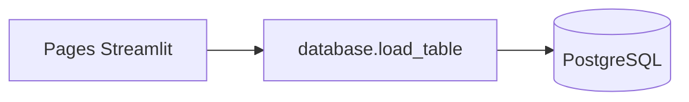

# Dashboard Streamlit

## Rôle

Interface de visualisation **temps quasi réel**. Le dashboard lit **uniquement PostgreSQL** (jamais Kafka ni MinIO). Les données sont rafraîchies via un cache Streamlit TTL de **5 secondes**.

## Structure

```text
dashboard/
├── Dockerfile
├── requirements.txt
├── Home.py                 # Page d'accueil
├── database.py             # Engine SQLAlchemy + load_table
├── .streamlit/config.toml
└── pages/
    ├── Resultats.py
    ├── Regions.py
    ├── Departements.py
    ├── Bureaux.py
    ├── Diaspora.py
    ├── Pays.py
    ├── Participation.py
    └── Monitoring.py
```

URL : http://localhost:8501

## Couche données (`database.py`)

| Fonction | Comportement |
| -------- | ------------ |
| `get_engine()` | `@st.cache_resource` — pool SQLAlchemy (`pool_pre_ping`, size 5) |
| `load_table(name)` | `@st.cache_data(ttl=5)` — `SELECT * FROM {table}` ; retourne DataFrame **vide** en cas d’erreur |
| `table_is_empty(df)` | Détecte None / empty |
| `show_empty_state(...)` | Message info + caption « en attente de Spark » |

Sécurité basique : le nom de table doit être un identifiant Python valide (`isidentifier()`).

Variables d’environnement : `POSTGRES_HOST`, `POSTGRES_PORT`, `POSTGRES_DB`, `POSTGRES_USER`, `POSTGRES_PASSWORD`.

## Pages et tables SQL

| Page | Fichier | Table(s) lue(s) | Contenu |
| ---- | ------- | --------------- | ------- |
| Accueil | `Home.py` | `resultats_candidats`, `resultats_regions`, `resultats_diaspora`, `participation_sexe` | KPI votes, candidats, régions, diaspora |
| Résultats | `pages/Resultats.py` | `resultats_candidats` | Table + barres Plotly |
| Régions | `pages/Regions.py` | `resultats_regions` | Répartition nationale |
| Départements | `pages/Departements.py` | `resultats_departements` | Votes par région/département |
| Bureaux | `pages/Bureaux.py` | `resultats_bureaux` | Votes par bureau |
| Diaspora | `pages/Diaspora.py` | `resultats_diaspora` | Continent / pays |
| Pays | `pages/Pays.py` | `resultats_diaspora` | Agrégation par `pays` |
| Participation | `pages/Participation.py` | `participation_sexe`, `participation_age`, `resultats_profession` | Démographie |
| Monitoring | `pages/Monitoring.py` | toutes les tables + `votes_bruts` | Compteurs, ping SQL |



## Robustesse empty-state

Avant les correctifs, plusieurs pages plantaient sur `.sum()` / Plotly avec DataFrames vides, et `Monitoring.py` / `Pays.py` étaient des stubs vides. Désormais :

- chaque page appelle `table_is_empty` avant visualisation ;
- `show_empty_state` affiche un message cohérent ;
- `Departements`, `Pays` et `Monitoring` sont implémentés et sûrs.

## Monitoring

La page Monitoring affiche :

1. Un tableau `table / lignes / statut` pour les 9 tables applicatives.
2. Un test `SELECT 1` sur la connexion.
3. Un aperçu du volume de `votes_bruts` (si non vide).

## Dépendances

Voir `dashboard/requirements.txt` (Streamlit, pandas, SQLAlchemy, psycopg2, Plotly, …).

## Dépannage rapide

| Symptôme | Cause probable | Action |
| -------- | -------------- | ------ |
| KPI à 0 | Pipeline pas encore prêt | Attendre batches Spark ; vérifier logs |
| Erreur connexion | Postgres down / mauvais `.env` | `docker compose ps postgres` |
| Données figées | Cache TTL | Attendre 5 s ou recharger la page |
| Page blanche historique | stub | Code actuel non vide — rebuild `dashboard` |
