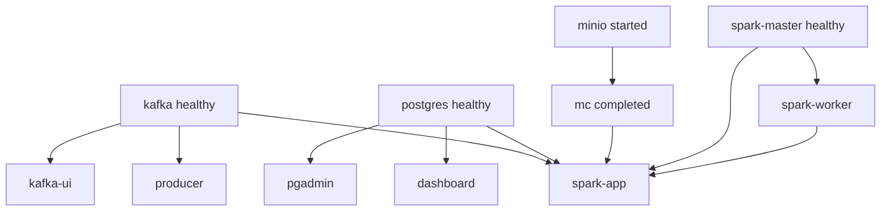

# Déploiement — from zero et rebuild

## Objectif

Déployer la stack complète sur une machine neuve, puis savoir reconstruire / mettre à jour les images sans perdre (ou en réinitialisant) les données.

## Déploiement from zero

### 1. Préparer la machine

- Installer Docker + Compose v2
- Libérer les ports listés dans [installation.md](installation.md)
- Allouer ≥ 8 Go RAM à Docker Desktop (recommandé)

### 2. Récupérer le code

```bash
git clone https://github.com/Yass-Rext/election-streaming.git
cd election-streaming
cp .env.example .env
```

Adapter les secrets si l’environnement n’est pas purement local (mots de passe MinIO / Postgres / PgAdmin).

### 3. Premier build

```bash
docker compose up --build -d
```

Ou :

```bash
./scripts/bootstrap.sh
```

### 4. Ordre de démarrage effectif



Le premier pull + téléchargement Maven Spark peut prendre plusieurs minutes.

### 5. Validation go-live

Checklist :

- [ ] `docker compose ps` : services up (sauf `mc` exited 0)
- [ ] Kafka UI : topic `votes` actif
- [ ] Logs producer : « Vote envoyé »
- [ ] Logs spark-app : « Fin batch »
- [ ] `SELECT COUNT(*) FROM votes_bruts` > 0
- [ ] MinIO : objets sous `votes/votes/`
- [ ] Streamlit : KPI non nuls

### 6. Exposition réseau

Par défaut, les ports sont publiés sur `0.0.0.0`. Sur un serveur distant :

- restreindre via firewall ;
- ne pas exposer Postgres / MinIO / Kafka sans TLS et auth ;
- changer tous les mots de passe du `.env`.

Ce Compose reste un **déploiement de démonstration**, pas une prod sécurisée.

---

## Rebuild des conteneurs

### Rebuild d’un service

```bash
docker compose build --no-cache spark-app
docker compose up -d spark-app
```

Services buildés localement : `producer`, `spark-app`, `dashboard`.

### Rebuild complet

```bash
docker compose build --no-cache
docker compose up -d
```

### Après modification du code monté en volume

| Service | Volume code | Action |
| ------- | ----------- | ------ |
| `producer` | `./producer/app` | `docker compose restart producer` |
| `spark-app` | `./spark/app` | `docker compose restart spark-app` (re-submit) |
| `dashboard` | (selon Dockerfile) | rebuild si pas de mount live |

Le `spark-app` exécute `spark-submit` au démarrage : un restart relance le job.

### Après modification de `Dockerfile` / `entrypoint.sh` / `requirements`

```bash
docker compose up --build -d <service>
```

### Après modification de `docker-compose.yml` ou `.env`

```bash
docker compose up -d
# ou recreate forcé :
docker compose up -d --force-recreate
```

---

## Stratégies de données

| Action | Commande | Effet |
| ------ | -------- | ----- |
| Stop soft | `docker compose stop` | Conteneurs arrêtés, volumes intacts |
| Down | `docker compose down` | Conteneurs + réseau retirés, volumes intacts |
| Reset total | `docker compose down -v` | **Perte** PG, MinIO, checkpoints, ivy |
| Reset checkpoints seuls | `docker volume rm …_spark_checkpoints` | Rejeu streaming selon offsets |

### Recréer uniquement le schéma PostgreSQL

Si le volume PG est neuf, `init.sql` s’applique automatiquement. Sur un volume existant, les `CREATE TABLE IF NOT EXISTS` ne migrent pas les colonnes : il faut migrer à la main ou `down -v`.

---

## Mise à jour depuis Git

```bash
git pull
cp .env.example .env   # seulement si nouvelles variables — fusionner manuellement
docker compose up --build -d
```

---

## Ressources Spark worker

Dans `.env` :

```env
SPARK_WORKER_MEMORY=2G
SPARK_WORKER_CORES=2
```

Puis :

```bash
docker compose up -d --force-recreate spark-worker spark-app
```

---

## Arrêt propre

```bash
docker compose down
```

Les logs producer / spark gèrent SIGTERM / KeyboardInterrupt pour fermer les clients Kafka et la SparkSession.
