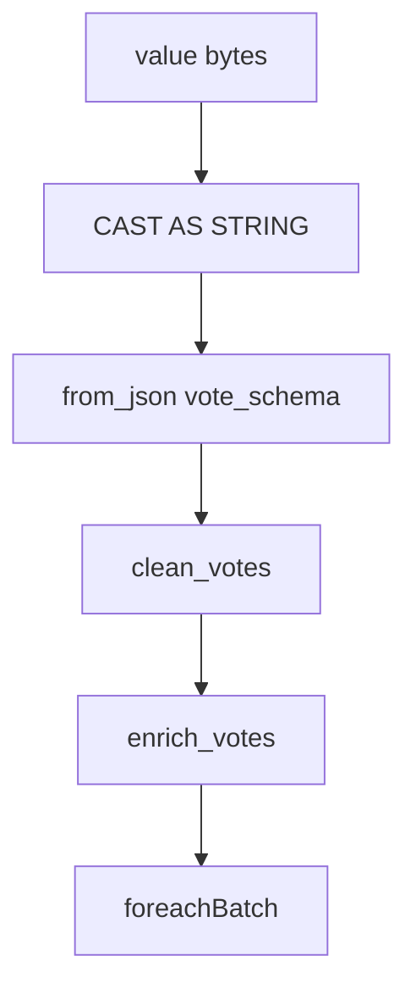

# Spark Structured Streaming

## Emplacement du code

Tout le job vit sous **`spark/app/`** (monté en volume et copié dans l’image) :

| Fichier | Rôle |
| ------- | ---- |
| `app.py` | SparkSession, lecture Kafka, `foreachBatch`, agrégations |
| `config.py` | Variables d’environnement |
| `constants.py` | Noms de tables PostgreSQL |
| `schemas.py` | `vote_schema` (StructType) |
| `transformations.py` | `parse` → `clean` → `enrich` |
| `aggregations.py` | GroupBy métier |
| `sinks/postgres.py` | JDBC append / overwrite |
| `sinks/minio.py` | S3A Parquet + credentials provider |
| `../entrypoint.sh` | Attente dépendances + `spark-submit` |
| `../Dockerfile` | `COPY app/ /app/` |

> Bug critique corrigé : le code était à la racine `spark/*.py` alors que le Dockerfile et Compose attendaient `spark/app/`. Le conteneur `spark-app` ne pouvait pas démarrer.

## Lancement (`entrypoint.sh`)

```bash
spark-submit \
  --master spark://spark-master:7077 \
  --deploy-mode client \
  --conf spark.driver.host=${SPARK_DRIVER_HOST} \
  --conf spark.sql.shuffle.partitions=${SHUFFLE_PARTITIONS} \
  --packages org.apache.spark:spark-sql-kafka-0-10_2.12:3.5.1,\
org.postgresql:postgresql:42.7.3,\
org.apache.hadoop:hadoop-aws:3.3.4,\
com.amazonaws:aws-java-sdk-bundle:1.12.262 \
  /app/app.py
```

Le même ensemble de packages est déclaré dans `SPARK_PACKAGES` dans `app.py` (config session).

## Packages Maven

| Package | Usage |
| ------- | ----- |
| `spark-sql-kafka-0-10_2.12:3.5.1` | Source Kafka Structured Streaming |
| `postgresql:42.7.3` | Driver JDBC |
| `hadoop-aws:3.3.4` | Filesystem S3A |
| `aws-java-sdk-bundle:1.12.262` | SDK AWS requis par S3A / MinIO |

Sans le bundle AWS, les écritures MinIO échouaient (ClassNotFound / credentials).

## SparkSession

Création dans `create_spark_session()` :

- `spark.sql.shuffle.partitions` ← `SHUFFLE_PARTITIONS` (défaut `4`)
- fuseau `UTC`
- sérialiseur Kryo
- Adaptive Query Execution (`spark.sql.adaptive.enabled=true`)
- `fs.s3a.impl` = `S3AFileSystem`
- niveau de log SparkContext : `WARN`

Puis `configure_minio(spark)` applique endpoint, clés, path-style et **`SimpleAWSCredentialsProvider`**.

## Lecture Kafka

```python
spark.readStream.format("kafka")
  .option("kafka.bootstrap.servers", ...)
  .option("subscribe", KAFKA_TOPIC)
  .option("startingOffsets", "earliest")
  .option("failOnDataLoss", "false")
  .option("maxOffsetsPerTrigger", "5000")
```

## Pipeline de transformation



### `clean_votes`

- `timestamp` → type timestamp ; `ingestion_time` = now
- normalisation sexe (`H/M` → `M`, `F` → `F`)
- filtres : âge ∈ [18, 120], `candidat` non vide, **`vote_id` non null**, `bureau` non vide, `type` ∈ {`SENEGAL`, `DIASPORA`}

### `enrich_votes`

- `est_diaspora` booléen
- `tranche_age` : `18-24`, `25-34`, `35-44`, `45-59`, `60+`

## Une seule requête : `foreachBatch`

```python
votes.writeStream.foreachBatch(process_batch)
  .outputMode("append")
  .trigger(processingTime=TRIGGER_INTERVAL)
  .option("checkpointLocation", "checkpoints/main")
  .queryName("election_main_pipeline")
  .start()
```

### Contenu de `process_batch`

1. `persist(MEMORY_AND_DISK)` du micro-batch
2. Skip si vide
3. `write_minio` (append Parquet)
4. `append_votes` → table `votes_bruts`
5. `refresh_aggregations` :
   - lecture JDBC de `votes_bruts`
   - `dropDuplicates(["vote_id"])`
   - `persist` + `count`
   - pour chaque agrégation : `write_postgres(..., mode="overwrite", truncate=True)`
6. `unpersist`

Les anciennes approches multi-queries (une query par sink) ont été abandonnées : checkpoints multiples, layout incohérent, coûts CPU.

## Checkpoints

| Élément | Valeur |
| ------- | ------ |
| Variable | `CHECKPOINT_BASE` (défaut `checkpoints`) |
| Emplacement effectif | `/app/checkpoints/main` dans le conteneur |
| Volume Docker | `spark_checkpoints` |

Pour repartir de zéro (relecture offsets selon `startingOffsets`) :

```bash
docker compose down
docker volume rm election-streaming_spark_checkpoints
docker compose up -d spark-app
```

## Agrégations

| Fonction | Table cible | Filtre |
| -------- | ----------- | ------ |
| `votes_par_candidat` | `resultats_candidats` | — |
| `votes_par_region` | `resultats_regions` | `type=SENEGAL` |
| `votes_par_departement` | `resultats_departements` | `type=SENEGAL` |
| `votes_par_bureau` | `resultats_bureaux` | — |
| `votes_diaspora` | `resultats_diaspora` | `type=DIASPORA` groupBy `continent`,`pays` |
| `participation_sexe` | `participation_sexe` | — |
| `participation_age` | `participation_age` | — |
| `votes_profession` | `resultats_profession` | `profession` non null |

## Logs

Format : `%(asctime)s | %(levelname)s | %(name)s | %(message)s`  
Logger principal : `spark-app`.

```bash
docker compose logs -f spark-app
```

## UI Spark

http://localhost:8081 — master, workers attachés, application `ElectionStreaming`.
