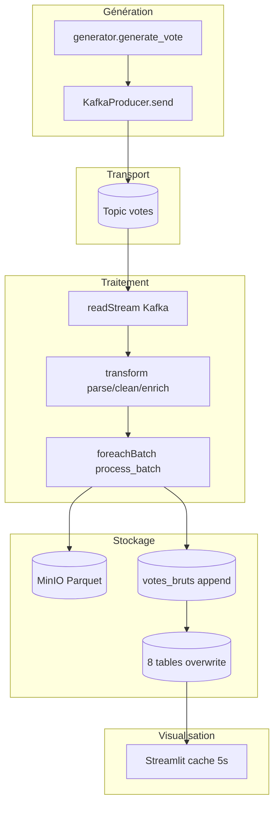
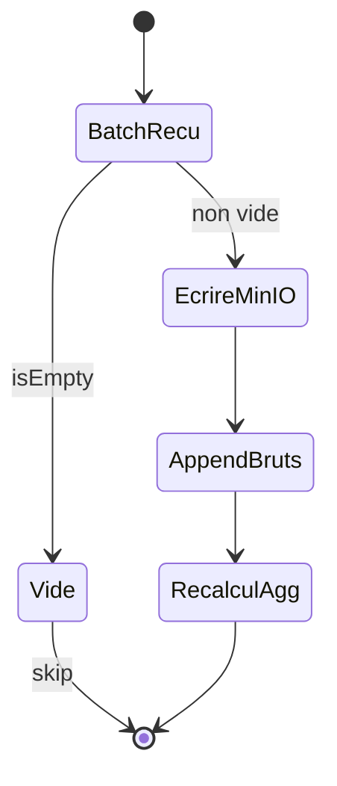

# Streaming — flux de données de bout en bout

## Chaîne nominale



## Étape 1 — Génération (Producer)

1. Tirage aléatoire Sénégal vs diaspora (`SENEGAL_VOTE_RATIO`).
2. Enrichissement depuis JSON de référence (candidats, centres, zones).
3. Attribution `vote_id` (UUID), `timestamp` UTC, `cni`.
4. Envoi Kafka clé=`vote_id`, valeur=JSON.

Fréquence : ~1 message / `VOTE_INTERVAL_SECONDS` (défaut 2 s).

## Étape 2 — Transport (Kafka KRaft)

- Topic `votes` (auto-créé ou via `kafka/create_topics.sh`).
- Persistance logs Kafka dans le conteneur (non volume-nommé dédié hors data Kafka interne).
- Consommation Spark avec `startingOffsets=earliest` au premier checkpoint.

## Étape 3 — Ingestion Spark

`readStream` lit les offsets, limite `maxOffsetsPerTrigger=5000`.

## Étape 4 — Transformation

| Étape | Effet |
| ----- | ----- |
| Parse | JSON → colonnes typées |
| Clean | Filtres qualité + types |
| Enrich | `est_diaspora`, `tranche_age`, `ingestion_time` |

Les messages invalides (sans `vote_id`, âge hors bornes, etc.) sont **silencieusement écartés**.

## Étape 5 — Micro-batch (`TRIGGER_INTERVAL`)

Pour chaque batch non vide, **dans le même `foreachBatch`** :

1. Archive Parquet → MinIO (`append`)
2. Append SQL → `votes_bruts`
3. Lecture complète `votes_bruts` + `dropDuplicates(vote_id)`
4. Recalcul des 8 agrégations
5. Overwrite + truncate de chaque table d’agrégation



## Étape 6 — Visualisation

Streamlit interroge PostgreSQL toutes les ~5 s (cache). Aucune dépendance directe au streaming : si Spark s’arrête, le dashboard continue d’afficher le **dernier état** des tables.

## Latence typique (local)

| Segment | Ordre de grandeur |
| ------- | ----------------- |
| Producer → Kafka | < 100 ms |
| Kafka → Spark (trigger) | ≈ `TRIGGER_INTERVAL` (5 s) |
| Batch (write + agg) | 1–10 s selon volume |
| Dashboard (cache) | ≤ 5 s après commit PG |

Latence bout-en-bout observée : souvent **5–20 secondes**.

## Garanties et sémantique

| Aspect | Comportement actuel |
| ------ | ------------------- |
| Au moins une fois | Possible rejeu après crash avant commit checkpoint |
| Déduplication agrégats | `dropDuplicates(vote_id)` sur l’historique PG |
| Table `votes_bruts` | Peut contenir des doublons d’append si rejeu ; filtrés pour les KPI |
| MinIO | Append de fichiers ; doublons possibles en cas de rejeu |
| Exactly-once bout-en-bout | Non garanti (environnement pédagogique) |

## Points de contrôle opérationnels

| Observation | Outil |
| ----------- | ----- |
| Messages arrivent | Kafka UI / console-consumer |
| Batches traités | `docker compose logs -f spark-app` |
| Bruts présents | `SELECT COUNT(*) FROM votes_bruts` |
| Parquet présents | Console MinIO |
| KPI à jour | Streamlit Home |

## Scénario d’échec typique (chaîne cassée)

```text
Producer OK → Kafka OK → Spark filtre tout (schéma)
  → votes_bruts vide → agrégations vides → dashboard à 0
```

Historiquement causé par l’absence de `vote_id` dans le JSON producer. Voir [troubleshooting.md](troubleshooting.md) et [changelog.md](changelog.md).
